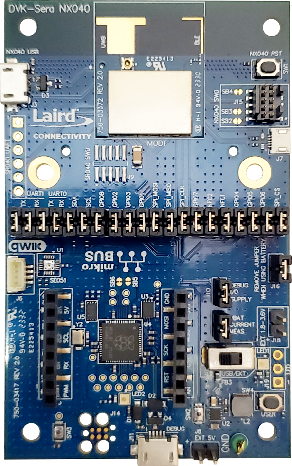

# Sera NX040 Firmware

Sera NX040 firmware is designed to get you up and developing embedded applications quickly on the Sera NX040 module using Python to operate its Ultrawideband (UWB) and Bluetooth Low Energy (BLE) radios. Hardware functionality is accessible via Python APIs and can be customized to meet the needs of the product integrating the Sera NX040 module. Python support is based on the [MicroPython](https://github.com/micropython/micropython "https://github.com/micropython/micropython") engine.
This firmware is distributed as a `.hex` file for use with programming tools such as `pyocd` to program the internal flash of the Sera NX040 module via SWD interface. The `.bin` files included in the release package can be used to perform OTA firmware update via supported mobile application tools. See **Programming Canvas Firmware with pyOCD** below.

<picture>
  <source media="(prefers-color-scheme: dark)" srcset="./img/canvas_logo_light.png">
  
</picture>

This firmware is a part of the <strong>Canvas Software Suite</strong> platform providing firmware, tools, documentation and sample applications to simplify software development on Laird Connectivity wireless products.
For more information about Canvas Software Suite see [https://www.lairdconnect.com/canvas](https://www.lairdconnect.com/canvas "https://www.lairdconnect.com/canvas").
If you would like to develop on the Sera NX040 module directly with the Nordic nRFConnect SDK, please contact [Laird Connectivity support](https://www.lairdconnect.com/resources/support "https://www.lairdconnect.com/resources/support") for assistance.

# Getting Started - Sera NX040 DVK

The Sera NX040 DVK provides all you need to get started evaluating and prototyping software applications on the Sera NX040 radio module. There are two variants available, [453-00174-K1 - Sera NX040 - UWB / Bluetooth LE Development Kit, MHF4L Connectors](https://www.lairdconnect.com/part/453-00174-k1 "https://www.lairdconnect.com/part/453-00174-k1") and [Sera NX040 - UWB / Bluetooth LE Development Kit, Integrated Antenna](https://www.lairdconnect.com/part/453-00175-k1 "https://www.lairdconnect.com/part/453-00175-k1").

 
_453-00175-K1 Sera NX040 DVK_

The primary interface used for programming and interfacing with the Sera NX040 DVK is the USB port near the bottom of the photo above (<strong>DEBUG</strong> label on silk screen). To get started, plug a USB-micro cable into the DEBUG port and attach it to your workstation. A small RGB LED will blink briefly white, indicating the board has been powered on.

# Programming Canvas Firmware with pyOCD

To program Canvas Firmware onto the Sera NX040 DVK, use the `pyocd` tool [available here](https://pyocd.io/ "https://pyocd.io/"). Pyocd requires Python to be installed on your workstation ([we recommend 3.11.6 for best compatibility](https://www.python.org/downloads/ "https://www.python.org/downloads/")).
Once `pyocd` is installed and you’ve attached the DVK to your workstation from the DEBUG USB port, type the following command into a terminal on your workstation to program the .hex file found as part of the firmware release:

`pyocd flash -t nrf52833 480-00336-R1.0.0.1697218537_full-image.hex`

NOTE: change the name of the .hex file to match the file in the release .zip file you’ve downloaded.

# The USB DEBUG Interface

The Sera NX040 DVK boards offer a single USB connection for access to SWD programming, USB-to-serial and other debugging functionality. This port implements a CMSIS-DAPLink interface allowing `pyocd` and similar tools access to the SWD port. For the Sera NX040 DVK, 2 serial ports are also available:

- <strong>Python REPL Console</strong> \- The primary interface to the MicroPython engine inside the Sera NX040 module
- <strong>Zephyr Shell Console</strong> \- The interface to the Zephyr RTOS\, primarily used for advanced debug functions

This hardware interface is provided by an RP2040 SoC installed on the DVK board running a customized version of [picoprobe](https://github.com/raspberrypi/picoprobe "https://github.com/raspberrypi/picoprobe") designed to operate with the Sera NX040 radio module.

# Accessing Python on the Sera NX040 Module

To access the Python REPL, open a terminal to the Python REPL Console serial port that appears after you’ve programmed the Canvas Firmware onto your Sera NX040 DVK using `pyocd` above. The terminal should display a `>>>` prompt when you press the ENTER key.
From this prompt, you can type Python statements and interact with the DVK hardware directly. For more information on general APIs available from MicroPython, please refer to the [MicroPython Libraries ](https://docs.micropython.org/en/latest/library/index.html "https://docs.micropython.org/en/latest/library/index.html")page. Note that not all libraries are supported by the Sera NX040 but this will still serve as a good reference for many common built-in functions and provide a good overview of MicroPython functionality.
For hardware-specific APIs pertaining to the Sera NX040 board specifically, please refer to the [Canvas Python API Documentation](https://lairdcp.github.io/canvas_python_docs "https://lairdcp.github.io/canvas_python_docs") page.
The REPL interface via serial port is the primary interface used by Canvas tools to load/save Python scripts onto the Sera NX040 module.

# Developing Python Scripts on the Sera NX040 Module

## The Xbit VS Code Extension

As part of Canvas Software Suite, we’ve developed the Xbit VS Code extension designed to make it easy to interface with compatible hardware such as the Sera NX040 DVK from a familiar code editing environment ([VS Code](https://code.visualstudio.com/download "https://code.visualstudio.com/download")). To get started, open the Extensions tab within VS Code, search for Xbit and install the **Xbit tools for VS Code** extension.

  
_Xbit Sidebar Menu Icon_

Once the Xbit VSC extension (Xbit VSC) is installed, an icon will appear in the sidebar menu of VS Code where you can access USB devices running compatible Canvas Firmware. With the Sera NX040 DVK attached to your workstation, clicking on the icon for Xbit VSC will display an entry in the USB DEVICES panel corresponding to each attached board with an `>>>` icon next to it indicating the detected serial port is running a Python REPL and is ready to go.

## Listing Python Scripts on the Sera NX040

Once the Sera NX040 DVK is listed in the USB DEVICES panel of Xbit VSC, click the device name for the board you’d like to interact with. For example, the Sera NX040 board should be listed as **Sera NX040 DVK** followed by a serial port identifier on your workstation. Clicking this will open the REPL serial port and expand the tree item in the panel to list the files available on the Sera NX040’s internal filesystem. If you’ve never programmed any Python scripts on the module before, this list will be empty. Note the `>>>` icon turns blue while the REPL serial port is open, making it easy to see when the port is active within Xbit VSC. To disconnect from the board, use the **Disconnect** button in the SELECTED DEVICE panel below the USB DEVICES panel. This will also close any corresponding Terminal windows open to the device and collapse the tree view item for the board in the USB DEVICES panel.

## Creating a Python Script on the Sera NX040

To create a new file on the Sera NX040’s internal filesystem, right-click the device in the USB DEVICES panel and select <strong>Create File</strong>. Type the name of the file you’d like to create, e.g. `test.py` and press ENTER. After a few seconds, the new file will appear in the tree view under the device in the USB DEVICES panel. Click on the file to open an editor within VS Code. Here you can enter a Python script that you’d like to save onto the device. When editing is finished, selecting `File->Save` or (`Ctrl+S` or `Cmd+S` depending on your platform) will save the file back to the Sera NX040’s filesystem.
To rename a file, right-click on the filename in the USB DEVICES panel and select <strong>Rename File</strong>.
To delete a file from the Sera NX040’s filesystem, right-click the file and select <strong>Delete File</strong>.
To refresh an editor pane from content in the Sera NX040’s filesystem, right-click and select <strong>Refresh</strong>.

### Drag and Drop Support

If you have a Python file already in your workstation’s filesystem and would like to just copy it to the device, Xbit VSC does support drag and drop of files directly onto the USB DEVICES panel to trigger a copy to the Sera NX040’s filesystem. From your system’s file explorer/finder, click and drag one or more `.py` files onto the tree view item for the corresponding DVK board you’d like to copy files to, then release to start the copy.

## Accessing the REPL Terminal

When an attached device is selected in the USB DEVICES panel of Xbit VSC, the REPL port is automatically opened and a new TERMINAL window is displayed typically near the bottom of the VS Code window. You can type in this terminal just as you would with any serial terminal attached to the REPL serial port to interact with the board directly via Python statements. This is also where output from the Python scripts will appear if you use `print()` or similar output functions from within your scripts.

# Running a Python Script

The Canvas Firmware interprets files named `boot.py` and `main.py` in a special way. If a file named `boot.py` exists in the Sera NX040’s filesystem, the Python engine will run this script after a RESET. If `main.py` exists, it will then run this script after running the `boot.py` script. This allows controlled sequencing of Python code to be executed after power-on of the Sera NX040 module.
To test out a Python script on the Sera NX040 module, simply rename the script you’ve saved using Xbit VSC to `boot.py` or `main.py` and restart the board. If you find the code is stuck in a tight loop or is not doing what you expect and need to interrupt it, connect to the board from Xbit VSC, select the board in the USB DEVICES panel and press the **Break** button in the SELECTED DEVICE panel below. You can also type `Ctrl+C` in the Terminal panel for the corresponding device.
To trigger a reset of the board from Xbit VSC, press the **Reset** button in the SELECTED DEVICE panel. You can also type `Ctrl+D` in the Terminal panel for the corresponding device.

# Next Steps

To make it easier to understand how to use Python to create your application scripts for the Sera NX040, a library of sample application scripts will be provided demonstrating many of the common use cases for the hardware. To see the latest list of available sample applications, visit [https://www.lairdconnect.com/canvas](https://www.lairdconnect.com/canvas "https://www.lairdconnect.com/canvas") and navigate to the **Sample Applications** section. The library of samples will be updated over time, so if you don’t see something you are looking for, feel free to reach out to [Laird Connectivity support](https://www.lairdconnect.com/resources/support "https://www.lairdconnect.com/resources/support") with any questions!
